# Revisión funcional y diagramas de flujo — Sistema de Soporte Técnico INIA

Fecha de revisión: 30 de julio de 2026

## Alcance y criterio

Esta revisión contrasta las rutas de Angular, los guardas de navegación, los
controladores REST, las reglas de autorización, los servicios de negocio y las
integraciones declaradas en el backend. Los diagramas describen el
comportamiento implementado, no un flujo teórico.

Convenciones:

- `READ_modulo`: permiso de consulta.
- `WRITE_modulo`: permiso de administración.
- `ADMIN`: acceso administrativo global.
- Todas las rutas, salvo el inicio de sesión, requieren un JWT válido.
- Las mutaciones relevantes pasan por el filtro de auditoría.

## Resultado general de la revisión

| Área | Consulta | Escritura | Persistencia o integración | Resultado |
|---|---|---|---|---|
| Autenticación | Sesión y perfil | Cambio de contraseña | Base local, BCrypt y JWT | Correcto |
| Dashboard | Indicadores según permisos | No aplica | Servicios de cada módulo | Correcto |
| Usuarios del sistema | Solo administrador | CRUD y permisos | Base local | Correcto |
| Usuarios de red | AD y contratos | Operaciones AD y CRUD de contratos | LDAP/AD y base local | Correcto, depende de AD |
| Correos | Consultas y estadísticas | Solo lectura | Vista/fuente GestionTI | Correcto |
| Equipos | Inventario, ficha y salud | Enriquecimiento y evidencias | GLPI, base local y archivos | Correcto |
| VPN | Registros y KPIs | Solicitud, revisión y antivirus | Base local y normalizada | Correcto |
| Impresoras | Lista, ficha e historial | CRUD, intervenciones y adjuntos | Base local y archivos | Corregido |
| WiFi | Lista y ficha | CRUD | Base local | Correcto |
| Licencias | Lista y ficha | CRUD | Base local y cifrado | Correcto |
| Herramientas | Ping, datos y órdenes | Gestión de órdenes | Red y base local | Correcto |
| Catálogos | Catálogos compartidos | CRUD y drivers | Base local y archivos | Correcto |
| Auditoría | Consulta con filtros | Automática | Base local | Correcto |
| Tiempo real | Suscripción SSE | Emisión interna | Memoria de aplicación | Correcto |

## Flujo general del sistema

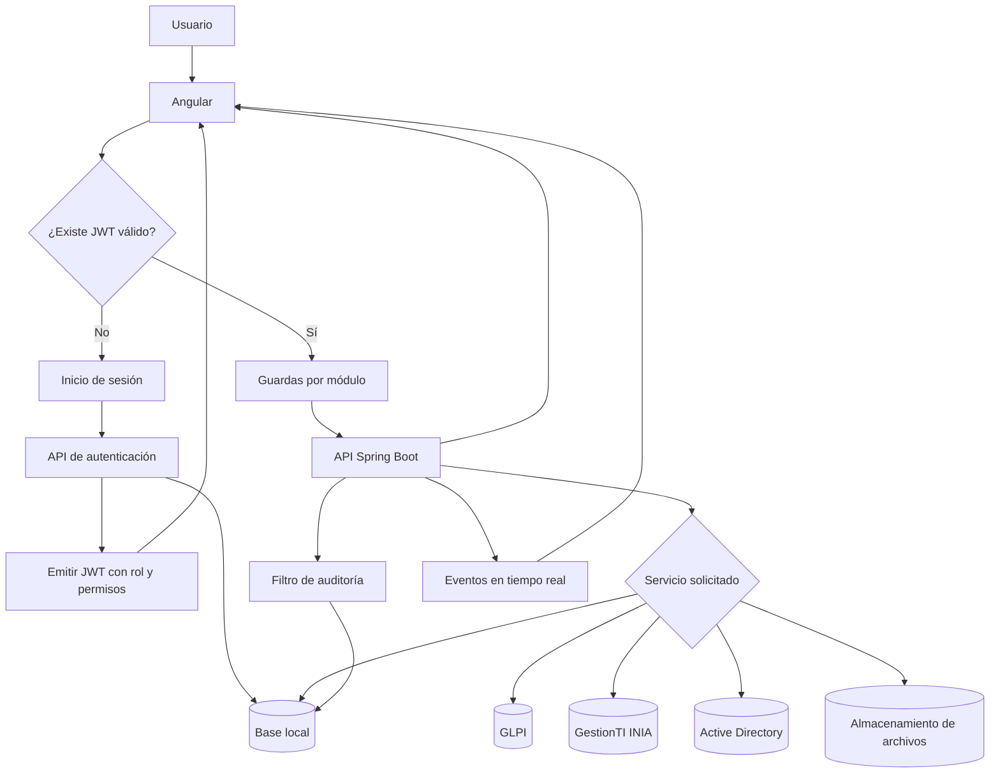

## 1. Autenticación y sesión

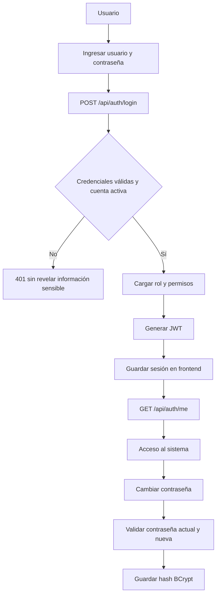

Uso: el usuario inicia sesión, el interceptor incorpora el JWT y los guardas
deciden qué módulos y acciones puede abrir.

## 2. Dashboard general

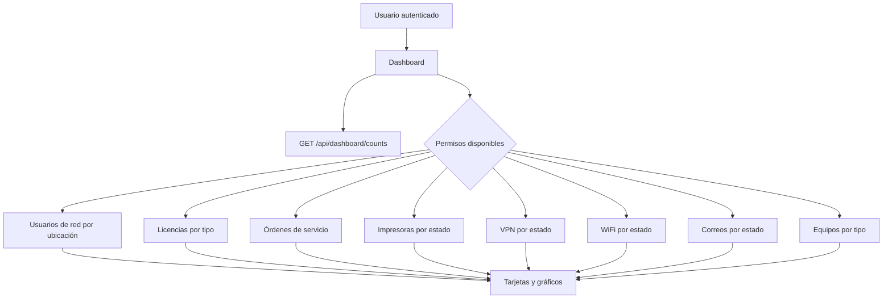

Uso: se consultan solamente los desgloses autorizados para el usuario. La
ausencia de un permiso no debe impedir que carguen los demás indicadores.

## 3. Usuarios del sistema y permisos

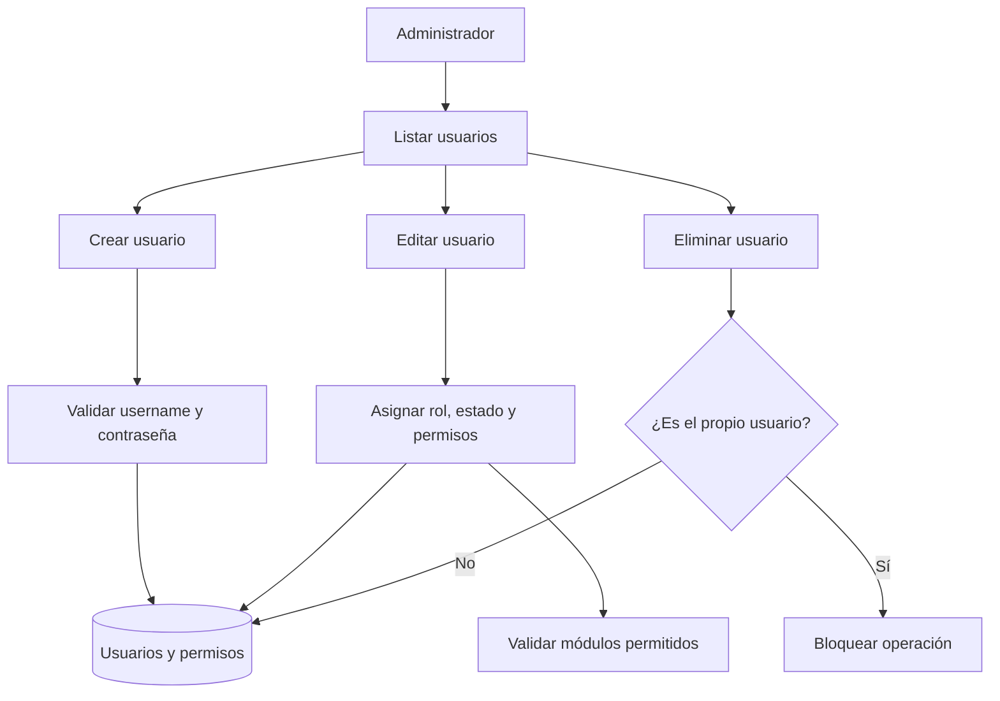

Uso: este módulo está protegido por rol `ADMIN`. Los permisos emitidos en el
JWT controlan lectura y escritura en los demás módulos.

## 4. Usuarios de red y Active Directory

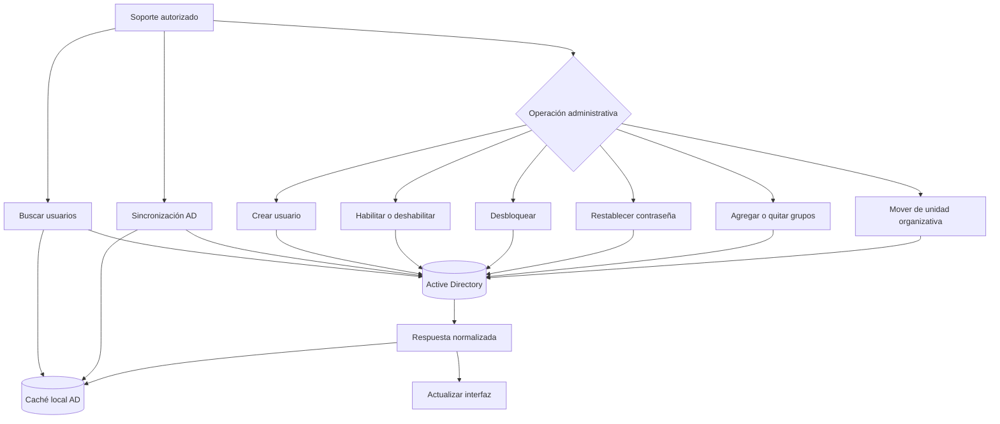

Uso: consultas requieren `READ_usuarios-red`; mutaciones requieren
`WRITE_usuarios-red`. La disponibilidad operativa depende de LDAP/AD.

### Contratos de usuarios de red

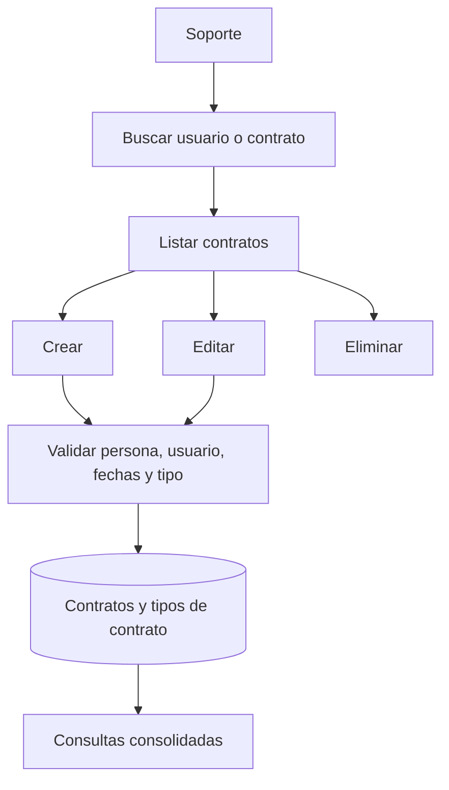

## 5. Correos

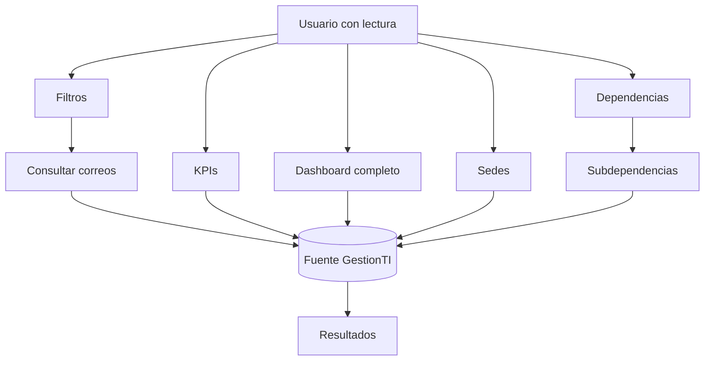

Uso: es un módulo de consulta. Los filtros de sede, dependencia y
subdependencia se obtienen de la misma fuente para mantener consistencia.

## 6. Equipos e inventario

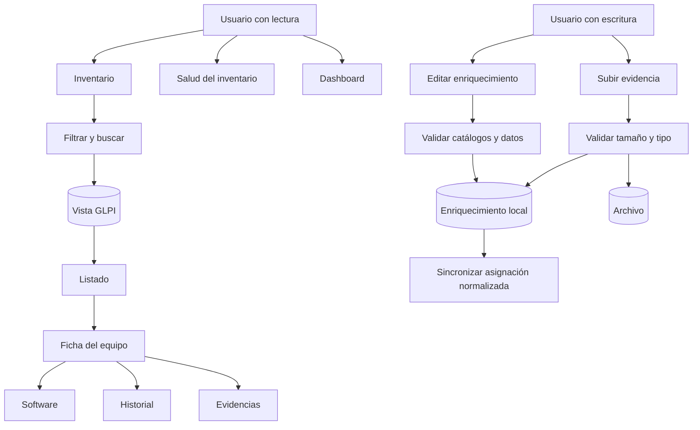

Uso: GLPI es la fuente del inventario; la información revisada, las
asignaciones y las evidencias se guardan localmente sin alterar la fuente
externa.

## 7. VPN

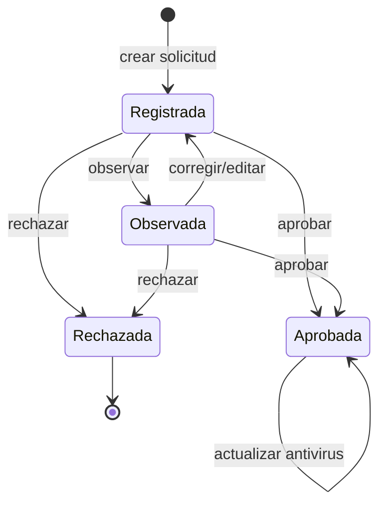

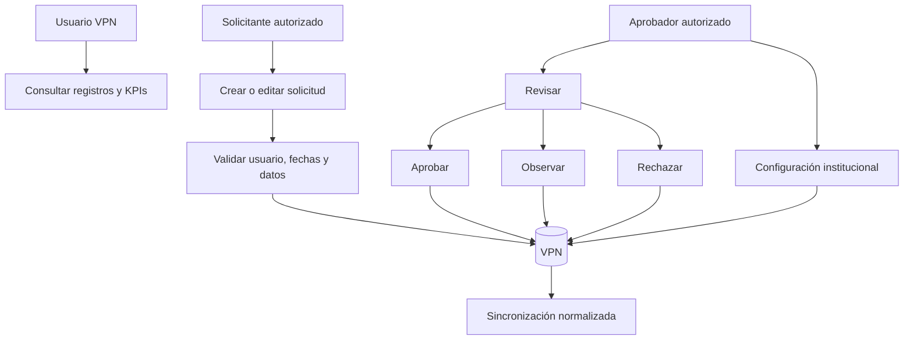

Uso: `WRITE_solicitar-vpn` y `WRITE_aprobar-vpn` separan responsabilidades.
La eliminación definitiva queda reservada al administrador.

## 8. Impresoras

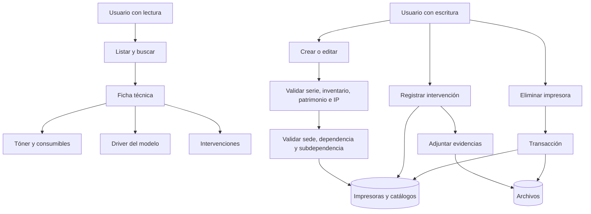

Uso: el listado ya evita ciclos de serialización en dependencias importadas.
Las ubicaciones se validan jerárquicamente antes de guardar.

## 9. WiFi

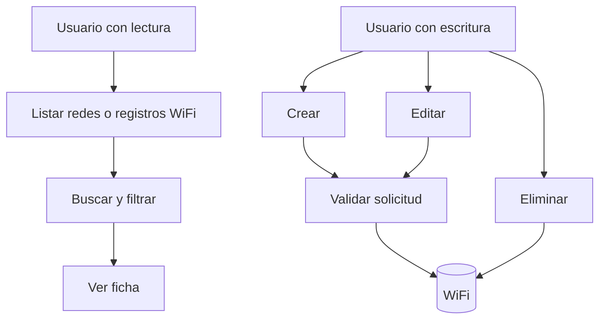

Uso: las consultas requieren lectura y las mutaciones escritura. El dashboard
general consume el desglose WiFi cuando el usuario tiene permiso.

## 10. Licencias

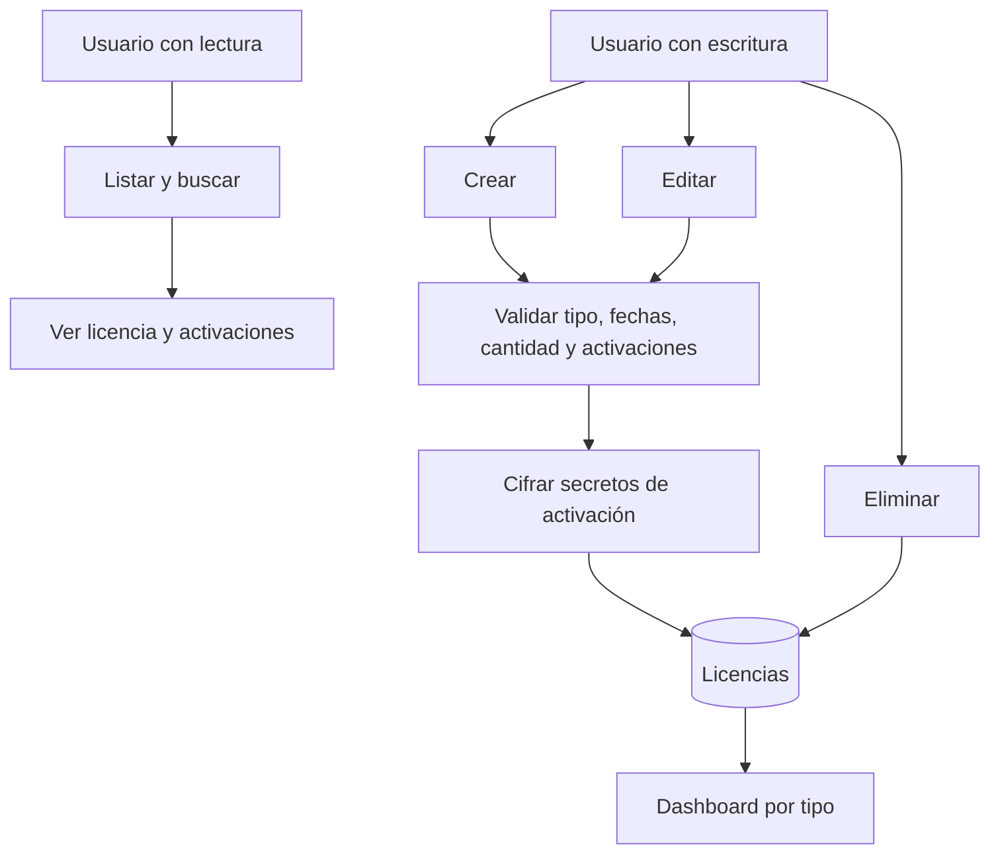

Uso: las credenciales sensibles se convierten mediante el componente de
cifrado antes de persistirse; no deben aparecer en logs ni respuestas de error.

## 11. Herramientas y órdenes de servicio

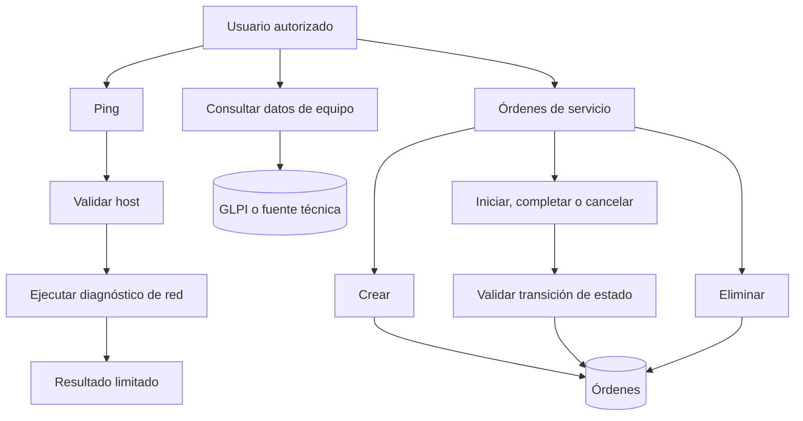

Uso: los parámetros de diagnóstico se validan antes de invocar procesos o
recursos de red. Las órdenes usan acciones explícitas para cambiar de estado.

## 12. Catálogos

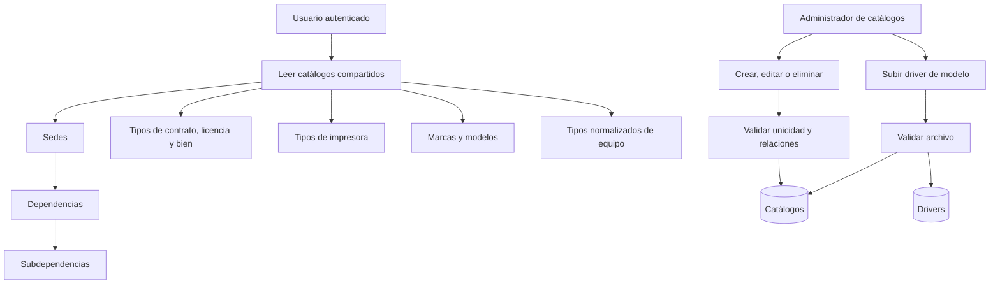

Uso: la lectura de catálogos se comparte con formularios de otros módulos. La
escritura requiere `WRITE_catalogos`.

## 13. Auditoría

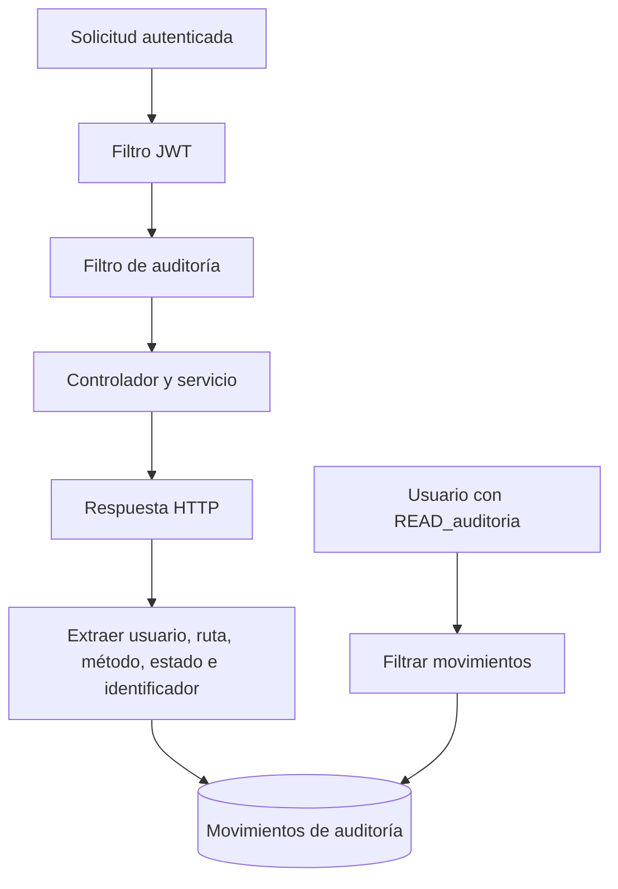

Uso: la auditoría se ejecuta después de autenticar y registra las mutaciones
sin almacenar contraseñas, tokens ni cuerpos sensibles.

## 14. Eventos en tiempo real

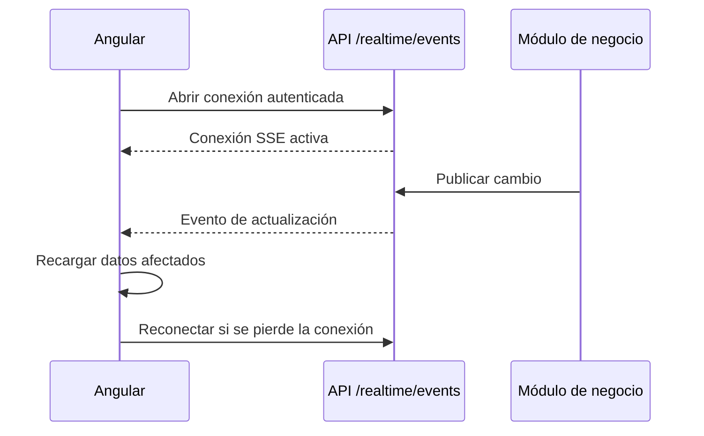

Uso: cualquier usuario autenticado puede mantener la suscripción; los datos
posteriores siguen protegidos por los permisos de sus respectivos endpoints.

## Validaciones transversales revisadas

1. El frontend protege navegación mediante guardas, pero la autorización
   efectiva está también en el backend.
2. Las operaciones administrativas usan `@PreAuthorize` con rol o autoridad.
3. Las credenciales se mantienen fuera de la documentación y los mensajes de
   error se normalizan.
4. Los archivos de equipos, impresoras y drivers se validan y se relacionan con
   una entidad antes de descargarse o eliminarse.
5. Los cambios se auditan después de validar el JWT.
6. Las fuentes externas (AD, GLPI y GestionTI) están separadas de los datos
   locales de enriquecimiento.
7. La lista de impresoras ya no serializa `dependenciaPadre`, evitando la
   referencia circular observada con los datos importados.

## Riesgos operativos y mantenimiento recomendado

- Active Directory, GLPI y GestionTI pueden dejar consultas parciales o no
  disponibles aunque la aplicación local continúe levantada.
- Los archivos y la base de datos no constituyen una única transacción física;
  se debe respaldar ambos repositorios.
- Algunos catálogos se encuentran referenciados por datos operativos; su
  eliminación puede ser rechazada por integridad referencial.
- El módulo de impresoras contiene registros heredados incompletos. Deben
  depurarse con información oficial, sin inventar IP, serie o patrimonio.
- Los eventos SSE son efímeros; después de una reconexión la interfaz debe
  volver a consultar el endpoint correspondiente.

## Lista de comprobación de aceptación

- Iniciar sesión y comprobar que el menú coincida con los permisos.
- Probar lectura y escritura con un usuario limitado y con un administrador.
- Abrir cada listado, ficha y dashboard.
- Comprobar una validación fallida y una operación exitosa por módulo.
- Verificar que las mutaciones aparezcan en Auditoría.
- Confirmar carga, descarga y eliminación de un archivo de prueba.
- Simular indisponibilidad de AD/GLPI en un ambiente de pruebas.
- Comprobar reconexión SSE y actualización de pantallas.
- Respaldar base de datos y almacenamiento antes de depurar datos heredados.
